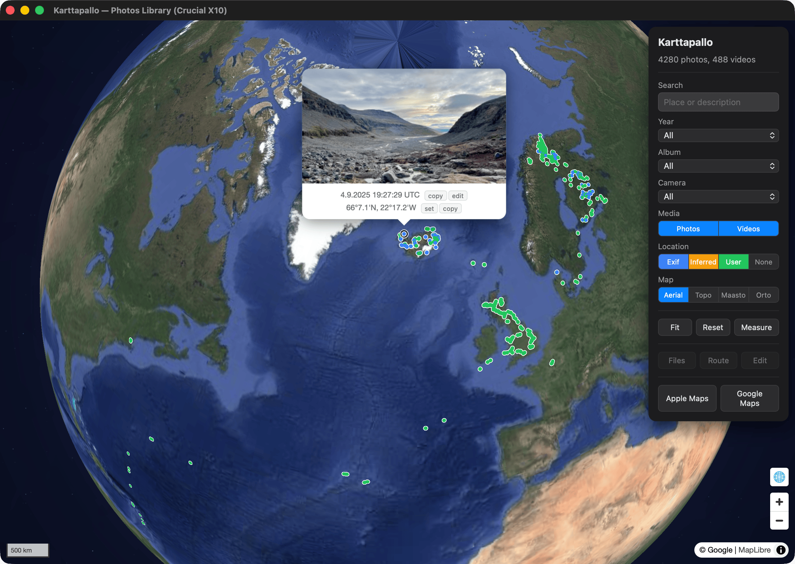

# Karttapallo

Globe view of an Apple Photos library — fix missing locations and wrong dates or timezones in place.

Photos and videos can be browsed in a built-in full-screen lightbox.



## Setup

Requires macOS, [Bun](https://bun.sh/), and Apple Photos with geotagged photos.

```bash
bun install
bun dev
```

To build and install to `/Applications`:

```bash
bun run cert --create   # one-time: create a self-signed code-signing cert
bun install:app         # build, sign, and copy to /Applications
```

Then grant the installed app **Full Disk Access** (System Settings ▸ Privacy &
Security). Without signing + FDA, macOS re-asks for the "access data from other
apps" permission on every launch and shows the app as "launcher" — see
[Gotchas](docs/gotchas.md).

### Optional API keys

Add either to `.env` to unlock extra features. Both are optional.

```
PUBLIC_MML_API_KEY=your-key   # MML — Maasto/Orto basemaps
PUBLIC_ORS_API_KEY=your-key   # OpenRouteService — Drive/Hike routing
```

Get keys from [MML](https://www.maanmittauslaitos.fi/rajapinnat/api-avaimen-ohje) and [OpenRouteService](https://openrouteservice.org/).

## Docs

- [CONTEXT](CONTEXT.md) — terms and relationships
- [App](docs/app.md) — code shape and seams
- [Flows](docs/flows.md) — interaction inventory
- [Gotchas](docs/gotchas.md) — non-obvious behaviors
- [Testing](docs/testing.md) — five-tier strategy
- [ADR](docs/adr/) — architectural decisions
- [Diary](docs/diary.md) — chronological log
